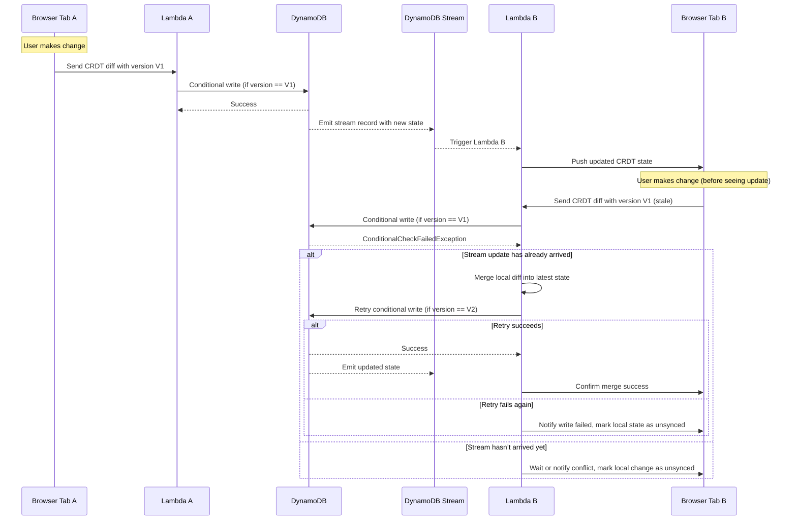
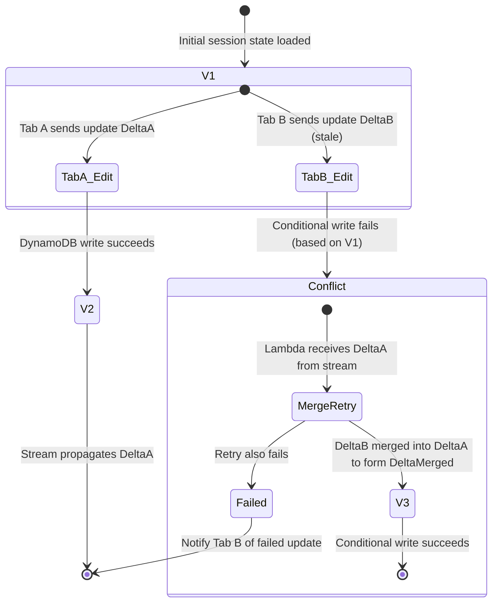

# Driving Architectural Change: Designing whilst Commuting

I was stuck in 1 hour and 50 minutes of traffic getting through the Westgate bridge in Melbourne and decided to put ChatGPT into conversational mode whilst I drove and also "drove" ChatGPT into some deep architectural conversations. 

This blog focuses on "the art of well framed questions" and critical thinking. 

Thought Leadership even. 🤣

> **Author:** Josh Peak  
> **Date:** 2025-06-25
>
> **Estimated Reading Time:** 5-10 Minutes

## Table of Contents
- [Intro: The Problem I Wanted to Solve](#intro-the-problem-i-wanted-to-solve)
- [The Meta-Structure of the Conversation](#the-meta-structure-of-the-conversation)
- [Starting with Exploration: Can Panel or Dash Be Serverless?](#starting-with-exploration-can-panel-or-dash-be-serverless)
- [Evolving Toward WebSockets and CRDTs](#evolving-toward-websockets-and-crdts)
- [Sequence Diagram: Real-Time CRDT Sync](#sequence-diagram-real-time-crdt-sync)
- [Architecture as Conversation: Confirmations, Rejections, and Tradeoffs](#architecture-as-conversation-confirmations-rejections-and-tradeoffs)
- [Failure Modes as Test Cases](#failure-modes-as-test-cases)
- [A Glimpse Into the Final Architecture](#a-glimpse-into-the-final-architecture)
- [Epilogue: How This Blog Was Curated](#epilogue-how-this-blog-was-curated)

---

## Intro: The Problem I Wanted to Solve

I started this journey with heavy traffic and an unstated but "driving" question:

> “Can I deploy a `pydeck`-like web app—akin to Panel, Dash, or Streamlit—that is truly serverless, scalable to zero, and not require a persistent server?”

My goal was to explore whether a modern data-driven UI could use WebSockets and serverless compute to achieve real-time interactivity without needing a long-running backend process.

---

## The Meta-Structure of the Conversation

This was not a simple linear build-up of ideas. Instead, I used a cyclical meta-structure of:

1. Exploration of technologies  
2. Architecture design  
3. Failure case analysis  
4. Decision locking

At each step, I used natural language prompts that mirrored how experienced architects operate during a whiteboard session. For example:

- **Exploring behavior:**  
  > “Do WebSockets need a long-running server, or can I make this serverless using something like Lambda?”

- **Design iteration through architecture testing:**  
  > “If the second Lambda tries to write, it fails, and we want to get a copy of the latest update... I need to de-duplicate inbound updates... and if that fails, that should go back to the user.”

- **Expanding through architectural boundary tests:**  
  > “Could I scope the session to a single user and allow them to forcefully unlock? What if multiple sessions race?”

- **Finalizing choices through summarization:**  
  > “Can you list out the architectural decisions that were confirmed and maybe some other items that were discussed but we didn't confirm?”

This technique—explore, iterate, summarize, decide—helped turn ideas into real architecture.

---

## Starting with Exploration: Can Panel or Dash Be Serverless?

I began by trying to understand the underlying mechanics of popular UI frameworks like Panel and Dash. They seemed a little too magic 🪄 ✨. I like my magic to be in my fantasy audiobooks, not my tech stack.

> “What’s the difference between Panel and Dash?”

I was probing how reactive Python apps link frontend actions to backend logic. These tools use WebSockets under the hood, but they usually assume a long-running Python process (like Tornado or Flask), which contradicts the serverless constraint.

> “Do WebSockets need a long-running server, or can I make this serverless using something like Lambda?”

If it is not a long-running server but instead it is a Lambda, then the connection is going to hang up and fail at some point. How do we gracefully restore those failures?

> **Side note**: I love the idea that "_The failure mode of an escalator is stairs_"

That led to AWS-native options like API Gateway WebSocket APIs, with Lambda handling messages and DynamoDB Streams for push-based eventing to restore broken WebSocket sessions.

---

## Evolving Toward WebSockets and CRDTs

Once I decided WebSockets could work robustly in a serverless way (and there was referencable prior art and not hallucinations), I moved onto the **shared session state problem**.

I introduced the idea of using **CRDTs** (Conflict-free Replicated Data Types) to manage collaborative updates:

> “If there are two browser tabs open on the same session, and they both edit... how do I avoid conflicts?”

This prompted a deep design loop involving conditional writes, DynamoDB Streams, and optimistic concurrency:

- “If a conditional write fails... wait for the stream to update you, then merge the change and retry.”
- “If the retry fails again, return an error to the user and mark the local state as failed.”

These ideas were then encoded in a **Mermaid.js sequence diagram**, helping clarify the logic path of sync, conflict, retry, and fallback.

_Fig 1 - Sequence Diagram – Real-Time CRDT Sync with Retry Logic_

---

## Architecture as Conversation: Confirmations, Rejections, and Tradeoffs

Throughout the conversation, I used confirmation prompts to **lock decisions**, exploratory prompts to test assumptions, and explicit rejections to prune the tree.

For example:

### ✅ Confirmed:
> _“I would like to confirm using DynamoDB Streams.”_  
> _“I want to use Python for the backend… because I'm familiar with it.”_

### ❌ Rejected:
> _“I do not want to apply any locks or locking mechanisms.”_

### 🤔 Explored:
> _“Would it make sense to use TTL-based locking?”_  
> _“What if we used conditional writes instead of locks?”_

By treating the chat as a living architecture document, I organically converged toward a complete design.

---

## Failure Modes as Test Cases

Another turning point in the conversation was when failure scenarios were used to **define automated test cases**.

For example:

> _“If the second Lambda tries to write and fails, we should receive the updated state via the stream, deduplicate, merge, and retry. If that fails, mark the local state as failed.”_

This complex failure sequence yielded multiple test cases:
- Validate CRDT conditional writes.
- Retry logic on stale state.
- Handling merge conflicts via streams.
- De-duplicating stream records.

These weren’t just theoretical exercises—they informed the future test harness design using PyTest and LocalStack.

_Fig 2 - State Diagram – CRDT Conflict Resolution_

---

## A Glimpse Into the Final Architecture

By the end of the process, the architecture had crystalized:

- **Frontend:** React app on S3, served via CloudFront with JWT auth via Lambda@Edge
- **Auth:** AWS Cognito for self-service sign-in
- **Realtime:** API Gateway WebSocket + Lambda + DynamoDB + CRDTs
- **Data API:** DuckDB querying Delta-format files in S3 (read-only)
- **Dev environment:** Fully local using Docker Compose and LocalStack

The core collaboration loop was expressed as:

> _"Each collaborative session is scoped to a DynamoDB table. CRDT state is read on connect, diffs are sent and conditionally written. Streams propagate updates to other Lambdas, triggering client-side state refresh.”_

## Conclusion

It was certainly a fun way to fill in the time this morning and iterate on some curious ideas.

From here I'd like to drop this solution architecture markdown file in to Claude Code and see how far it gets iterating until it meets the design spec.

Overall it's been helpful to reflect on the deeper parts of craftsmanship iterations and critical thinking.

---

## Epilogue: How This Blog Was Curated

This blog post was generated **after** the architectural design was fully captured in a Markdown software architecture document. The process used exact user quotes and prompts to reconstruct the **meta-level structure** of architectural thinking.

Here’s a sample of how the blog was asked to be structured:

> _“Summarise the interaction into a blog post… focus on the types of questions I was using… the critical thinking applied… the metastructure of the conversation… and how failure modes become definitions for test cases.”_

This post is not only a summary—it is also a **model of technical leadership through structured curiosity, synthesis, and design decisions**.

---

Interested in seeing the raw architecture file with all diagrams and confirmed decisions? [View the project architecture here.](solution-architecture-specification.md)
