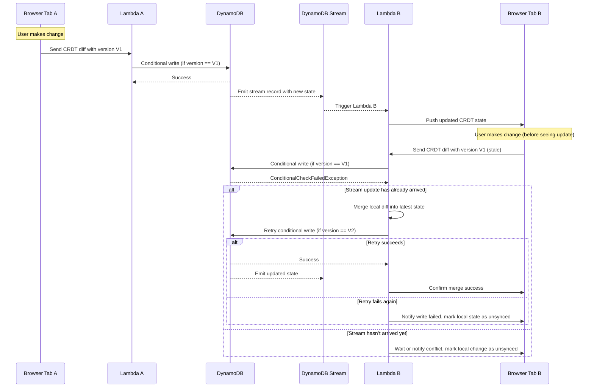
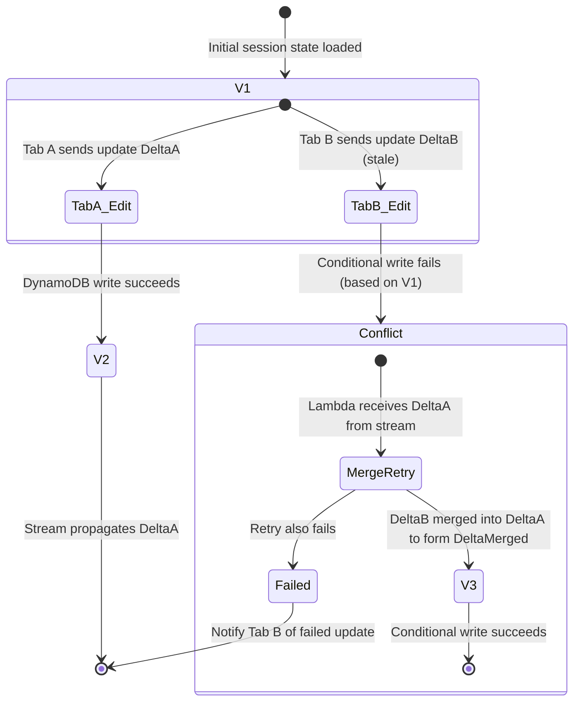

```mermaid
graph TD
  subgraph Frontend
    A["React App"] -->|Deployed to| B["S3 Bucket (static)"]
    B -->|Served via| C["CloudFront"]
    C -->|JWT check| D["Lambda@Edge"]
  end

  subgraph Auth
    E["Cognito Hosted UI"] -->|Auth Flow| F["Cognito User Pool"]
    F --> G["JWT issued"]
  end

  subgraph Backend
    H["API Gateway - WebSocket API"] --> I["Lambda (WebSocket handler)"]
    I --> J["DynamoDB - Session Table"]
    J --> K["DynamoDB Stream"]
    K --> L["Lambda (Stream processor)"]
    L --> M["Browser Clients via WebSocket"]
  end

  subgraph DataAPI
    N["API Gateway - REST /api/"] --> O["Lambda (DuckDB query)"]
    O --> P["S3 - Delta Lake Format"]
  end
```

# Serverless Collaborative Application Architecture – 2025-06-25

This document captures the architectural vision, implementation patterns, and confirmed decisions for a serverless, real-time collaborative web application.

---

## ✅ Confirmed Architectural Decisions

### Runtime Stack

- **Language:** Python
- **Web framework:** FastAPI
- **Testing framework:** PyTest
- **Infrastructure as Code:** AWS CDK
- **Local Development:** LocalStack via `docker-compose.yml`

### Cloud Architecture

- **Cloud Provider:** AWS
- **Compute:** AWS Lambda
- **Storage:** DynamoDB
- **Pub/Sub:** DynamoDB Streams
- **Authentication:** AWS Cognito (user sign-up/login required)
- **Session Validation:** JWT (ID tokens passed via WebSocket messages)
- **Data API (Read-Only):** DuckDB connected to S3 in Delta Lake format
- **Frontend Hosting:** React app hosted on S3 and served via CloudFront
- **Authentication Routing:** Lambda\@Edge for redirect + token enforcement at CloudFront edge

### Application Architecture

- **WebSocket-based collaboration:** API Gateway WebSocket API
- **CRDT state model:** Each collaborative session is scoped to a DynamoDB table
- **Diff-only updates:** Clients send and receive changes as diffs to avoid large state sync
- **Optimistic concurrency:** Conditional writes using `ConditionExpression` on version field
- **Stream-driven updates:** DynamoDB Streams notify other clients and Lambdas
- **No locks:** Conflict resolution is CRDT-based only
- **Retry-on-failure logic:** On conditional write failure, merge and retry
- **UI Architecture:** React app connects to WebSocket after Cognito login

---

## 🧪 Explored But Not Finalized

- CRDT implementation details (type, structure, and merge resolution)
- Stream de-duplication cache/strategy
- Delta serialization/compression
- Conflict retry UX: marking, retrying, or visual feedback to users

---

## 🚫 Explicitly Rejected

- Distributed locking (due to complexity and bottlenecks)

---

## 📊 Sequence Diagram – Real-Time CRDT Sync with Retry Logic

---

## 📈 State Diagram – CRDT Conflict Resolution

---

## 🏗️ Infrastructure Diagram – Cloud Resources (CDK)

---

This document will evolve as implementation progresses and more design decisions are locked in. 

